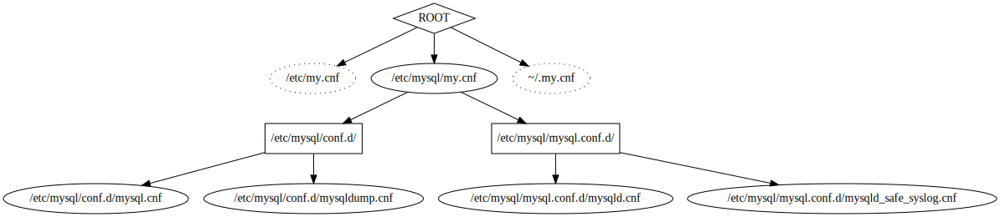

# mysql-conf-graph

Analyses which config files are read by mysql and outputs a directed graph in the `dot` language.
`dot` is a part of the `graphviz` package.

Use this syntax to create an image file:

    mysql-cnf-graph | dot -T<type> -o<filename>

where `filename` is the file that will be generated and `type` can be, for example, `pdf` or `svg`.
If you use `svg`, each file node in the diagram will be linked to the actual file. Open the svg file in a browser so that the links will be clickable.

## Example
