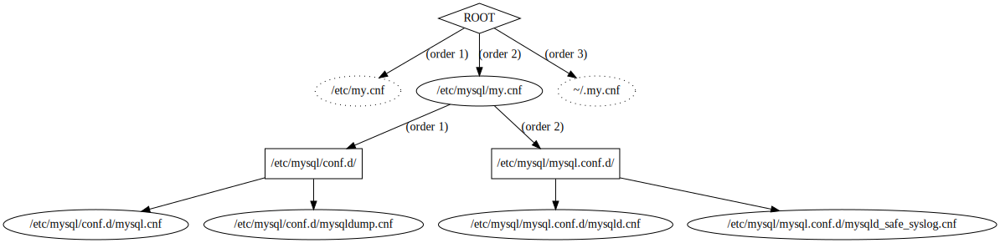

# mysql-conf-graph

Analyses which config files are read by `mysqld` and outputs a directed graph in the `dot` language.
`dot` is a part of the `graphviz` package.

Use this syntax to create an image file:

    mysql-cnf-graph | dot -T<type> -o<filename>

where `filename` is the file that will be generated and `type` can be, for example, `pdf` or `svg`.
If you use `svg`, each file node in the diagram will be linked to the actual file. 
Open the svg file in a browser so that the links will be clickable.

Please note that the order of `!include` and `!includedir` is significant, as well as the order of 
the root config files. Dot does not guarantee the ordering of nodes, so ordering will be labled.
Anyway, the [MySQL documentation](https://dev.mysql.com/doc/refman/5.7/en/option-files.html) says:

> MySQL makes no guarantee about the order in which option files in the directory will be read.

Therefor, no ordering labels are added to those files.

## Example
